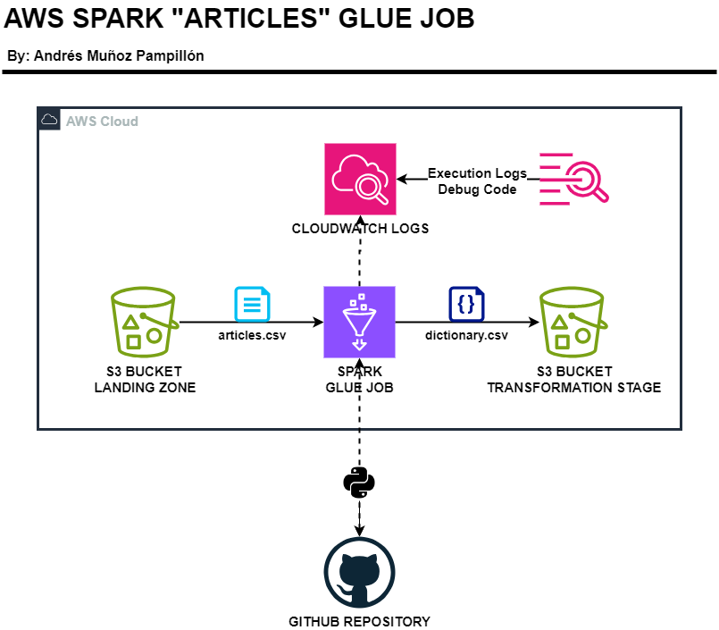

# AWS SPARK GLUE JOB

In this PySpark project with AWS, I present a solution to the given problem. The task involves reading an `articles.csv` file that contains information about a clothing store. Using Spark, a dictionary needs to be generated using the `product_type_no` column as the key and the `product_type_name` column as the value. This dictionary should then be exported as a .csv file. Additionally, an inner join should be performed later to compare the total number of rows.

## METHODOLOGY

To accomplish these tasks, I decided to work with the following AWS technologies:
- S3: Storage
- Glue: Code execution
- CloudWatch: Execution logs, debugging, and output tracking
- Python: ETL using PySpark
- GitHub: Remote repository

----

### Python

Using the AWSGlue and Spark libraries, the ETL (Extract, Transform, Load) process is performed on the file stored in S3.

### S3

Two buckets were used for file storage:
- Landing Zone: For the `articles.csv` file.
- Transformation Stage: For the produced .csv file containing the dictionary information.

### Glue

Since the requirement is to work with Spark, the Glue service allows code execution in Python. Using PySpark, it's possible to read information from the Landing Zone bucket and save the results in the Transformation Stage bucket. Additionally, Glue Jobs can be run on demand or scheduled periodically at a defined time using the schedule option.

The code can be reused as it runs based on parameters defined as Job Parameters during execution.

Glue allows synchronization of the script with GitHub.

### CloudWatch

This service logs each execution of Glue Jobs, helping to identify errors. It also provides a Log Event for the output generated by Python, which is very useful for debugging code or logging outputs.

### GitHub

Used for code control and versioning from AWS, allowing file synchronization. It is recommended to use a GitHub Personal Access Token instead of a password for this purpose.
